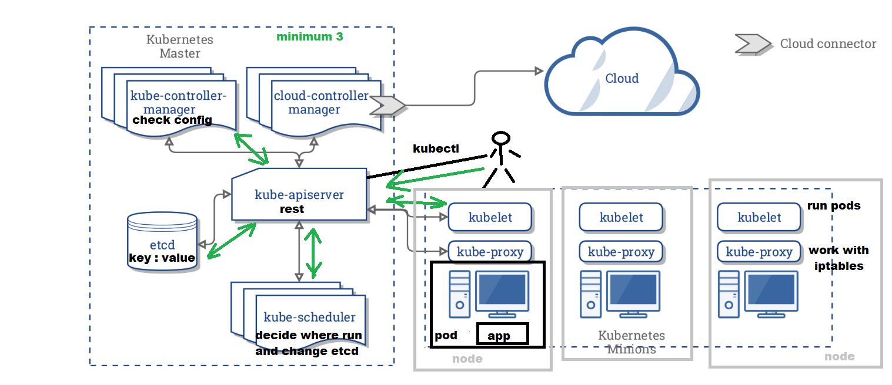

# Kubernetes-course

## Content

 [Minicube](#minicube)
 
 [Kubectl](#kubectl)
 
 [AWS](#aws)
 
 [GCP(Google cloud)](#gcp)
 
 [Pods](#pods)
 
 [Deployments](#deployments)
 
 [Services](#services)
 
 [INGRESS Controllers](#ingress-controllers)
 
 [Helm](#helm)
 

## Minikube 

[Content](#content)

`minikube version`   -show version of minicube

`minikube start`     -create and run k8s with default parameters

`minikube stop`      -stop minicube

`minikube delete`    -delete minicube with cluster

`minikube ssh`      -create login with our cluster

`minikube start --nodes 2 -p multinode-demo`  - 2 nodes

`minikube start --nodes 3 --cpus=4 --memory=8gb --disk-size=5gb` -start 3 node with cpus and memory and disk parameters

`minikube start --cpus=4 --memory=8gb --disk-size=5gb`       -start with defined parameters

`minikube start --cpus=2 --memory=6000mb --disk-size=4000mb` -start with defined parameters

## Kubectl 

[Content](#content)

`kubectl version`              -show version of kubectl client and server

`kubectl version --client`     -show version of kubectl client

`kubectl get componentstatuses` -show state of cluster

`kubectl cluster-info`          -show info about k8s cluster

`kubectl get nodes`             -show  all servers k8s cluster

## AWS 

[Content](#content)

Install awscli, kubectl, eksctl

Kubernetes - eksctl configuration(https://eksctl.io) Place config(~/.kube/config)

`eksctl create cluster -f mycluster.yaml`    -create and run k8s cluster with file parameters

`eksctl delete cluster -f mycluster.yaml`    -delete our k8s cluster

`eksctl version`                             -show eksctl version

`eksctl create cluster`                      -create default cluster

`eksctl delete cluster`                      -delete cluster

## GCP(Google cloud) 

[Content](#content)

Need to install google cloud sdk

`gcloud version`                                   -show version of gcloud

`gcloud init`                                      -setting gcloud with your Cloud

`gcloud services enable container.googleapis.com`  -turn on creating k8s in your google cloud project

`gcloud container clusters create name`            -create and run k8s cluster with default parameters

`gcloud container clusters create name --num-nodes=4` -create and run cluster with our parameters

`gcloud container clusters get-credentials name`     -setting up kubectl for work with our cluster

`gcloud container clusters delete name`              -delete our cluster

## Pods 

[Content](#content)

`kubectl get pods`    -show all pods

`kubectl run hello --generator=run-pod/v1 --image=nginx:latest --port=80` -create pod from dockerImage nginx and open port 80

` --generator=run-pod/v1 ` -for google in minicube not needed

`kubectl port-forward hello 7777:80` - Our port 7777 now is port 80 our pod

`kubectl describe pods hello` -show all inf about pod hello

`kubectl delete pods hello`  -delete pod hello

`kubectl logs hello` -show log from pod hello

`kubectl exec my-web date` -run command date on pod my-web

`kubectl exec -it my-web bash` -run command bash interactively on pod my web

`kubectl apply -f myfile.yaml` -create objects in k8s from file myfile.yaml

`kubectl delete -f myfile.yaml` -delete objects from k8s from file myfile.yaml

[pod-hello](pod-hello.yaml)

[pod-myapp](pod-myapp.yaml)

[pod-myweb](pod-myweb.yaml)

## Deployments

[Content](#content)

`kubectl get deployments`    -show all deployments

`kubectl get rs`    -show all replicaSets

`kubectl create deployment name-deployment --image httpd:latest`    -create deployment from dockerImage httpd:latest

`kubectl describe deployments name-deployment`    -show all info about deployment name-deployment

`kubectl scale deployment name-deployment --replicas 4`    -create replicaSets

`kubectl autoscale deployment name --min=10 --max=15 --cpu-percent=80`    -create autoScaling for deployment name

`kubectl get hpa`    -show all HPA- Horizontal Auto Scallers

`kubectl set image deployment/name-deployment k8sphp=adv4000/k8sphp:version2 --record`    -set deployment name Image to new

`kubectl rollout status deployment/name-deployment`    -show status updating

`kubectl rollout history deployment/name-deployment`    -show history updating

`kubectl rollout undo deployment/name-deployment`    -rollback to previous version

`kubectl rollout undo deployment/name-deployment --to-revision=2`    -rollback to version 2

`kubectl rollout restart deployment/name-deployment`    -redeploy current version

`kubectl delete deployments name-deployment`    -delete deployment name-deployment

`kubectl apply -f deployment-3-autoscaling.yaml` - createdeployment from file

`kubectl port-forward my-web-deployment-autoscaling-8fd84cf84-9gjrn 7777:80` - Our port 7777 now is port 80 our pod

`kubectl delete deployments my-web-deployment-autoscaling`- delete by name deployment(`kubectl get deployments`)

`kubectl delete -f deployment-3-autoscaling.yaml` -delete by file deployment

`kubectl delete deployment --all` - delete all deployment

[simple deployment](deployment-1-simple.yaml)

[with replicas](deployment-2-replicas.yaml)

[autoscaling](deployment-3-autoscaling.yaml)

## Services 

[Content](#content)

`kubectl create deployment name-deployment --image httpd:latest`    -create deployment from dockerImage httpd:latest

`kubectl describe deployments name-deployment`    -show all info about deployment name-deployment

`kubectl expose deployment name-deployment --type=ClusterIP --port80`    -create Service type ClusterIP for Deployment

`kubectl expose deployment name-deployment --type=NodePort --port80`    -create Service type NodePort for Deployment

`kubectl expose deployment name-deployment --type=LoadBalancer --port80`    -create Service type LoadBalancer for Deployment

`kubectl get services`    -show all services 

`kubectl get svc`    -show all services

`kubectl describe nodes | grep ExternalIP`    -show External IP from all worker nodes

`kubectl describe nodes | grep InternalIP`    -show Internal IP from all worker nodes port where our service also need specify port from get svc(for minicube)

`kubectl delete services my-webserver`    -delete service my-webserver

`kubectl apply -f service-1-loadbalancer-single.yaml` -create service from yaml

`kubectl delete -f service-1-loadbalancer-single.yaml` -delete service from yaml

[loadbalancer with one container](service-1-loadbalancer-single.yaml)

[loadbalancer with two containers](service-2-loadbalancer-multi.yaml)

[loadbalancer with autoscaling](service-3-loadbalancer-autoscaling.yaml)

## INGRESS Controllers 

[Content](#content)

`kubectl apply -f https://projectcontour.io/quickstart/contour.yaml`    -create Ingress controller contour

`kubectl get services -n projectcontour envoy -o wide`    -show ingress controller load balancer data

`kubectl create deployment main --image httpd:latest`    -create deployment

`kubectl create deployment web1 --image=adv4000/k8sphp:version1`    -create deployment from Image

`kubectl create deployment web2 --image=adv4000/k8sphp:version2`    -create deployment from Image

`kubectl scale deployment main --replicas 2`    -create replicaSets

`kubectl scale deployment web1 --replicas 2`    -create replicaSets

`kubectl scale deployment web2 --replicas 2`    -create replicaSets

`kubectl expose deployment main --port 80 #--type=ClusterIP DEFAULT`    -create service type by default ClusterIP

`kubectl expose deployment web1 --port 80 `    -create service

`kubectl expose deployment web2 --port 80`    -create service

`kubectl expose deployment tomcat --port 8080`    -create service

`kubectl get services -o wide`    -show info all services

`kubectl apply -f ingress-hosts.yaml`    -create ingress rules from file

`kubectl apply -f ingress-paths.yaml`    -create ingress rules from file

`kubectl get ingress`    -show all created ingress rules

`kubectl describe ingress`    -show all ingress rules fully

`kubectl delete ns projectcontour`    -delete ingress controller contour

[ingress hosts](ingress-hosts.yaml)

[ingress paths](ingress-paths.yaml)

## HELM 

[Content](#content)

[folder helm](HELM)

`helm install app Chart-Sv/`    -deploy helm

`helm list`    -show all helms

`helm install app1 Chart-Sv/ --set containet.image=adv4000/k8sphp:version1 --set replicaCount=3`    -deploy and set image and replicas

`helm upgrade app1 Chart-Sv/ --set containet.image=adv4000/k8sphp:version1 --set replicaCount=2`    -upgrade deploy set replicas

`helm install app2 Chart-Sv/ -f prod_values.yaml`    -deploy with prod values

`kubectl get svc`    -show services

`helm package Chart-Sv/`    -create .tgz file(in name will be version from Chart.yaml file)

`helm install app4 App-HelmChart-0.1.0.tgz`    -install from file with default values

`helm search repo`    -search repository locally

`helm search hub apache`    -search on artifacthub repo with apache tag

 `helm repo add bitnami https://charts.bitnami.com/bitnami` -add repository
 
 `helm search repo bitnami`                                 -find repositiry
 
 `helm install my-release bitnami/<chart>`
 
 `helm install website bitnami/apache` -install from repo
 
 `helm install website bitnami/apache -f apache_webpage.yaml`  -install apache and put into webpage from github according file apache_web..
 
 `helm delete name1 - delete deployment

